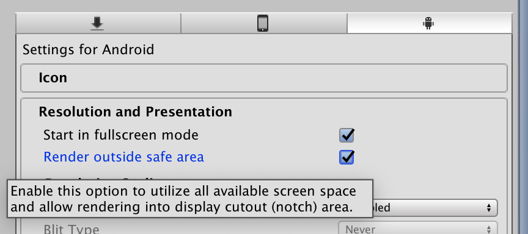

# Notch Solution

<object type="image/svg+xml" data="https://opencollective.com/notch-solution/tiers/backer.svg?avatarHeight=36&width=600"></object>

A set of components and tools to solve notched/cutout phones layout problems for Unity. Whether you like it or not, the time has come for us designers to design in context of a notch and embrace it instead of hiding it. This tool also enables design-time preview which help you iterate your design without building the game. Minimum Unity version 2019.1.

## Reason for open source

I believe screen cutout problem must be solved collaboratively. I think there are many variations and potentially different permutation of problems that bound to happen later. Over time, having more inputs from users together we could make this more stable than I could ever made alone.

In this regard for financial support, instead of revenue from Asset Store, the main way will be through Open Collective. (https://opencollective.com/notch-solution) The backers are displayed just under the opening image.

Alternatively, you could also check out the **Sponsor** button on top of this page where there is a link to my other Asset Store items, that way you could have some Unity tools in return as my thanks for a contribution. Thank you!

The Discord channel [is also available here!](https://discord.gg/J4sCcj4) You could come and express your wishlist or issues. (You could also use the Issues section.)

# Installation

## Include with GitHub functionality of Unity Package Manager

Add this line `"com.e7.notch-solution": "git://github.com/5argon/NotchSolution.git",` to your `manifest.json`.

It does not update automatically when I push fixes to this repo. You must remove the lock line that appears in you `manifest.json` file to refetch. Otherwise you would better do a direct copy.

It will be on Unity Asset Store later too, but currently I don't think it is Asset Store worthy. There are some weird glitches remaining. (See [Issues section](https://github.com/5argon/NotchSolution/issues))

## `Screen.safeArea` requirement

Some key components are using `Screen.safeArea`. For Android, **your player's phone has to be on Android P AND also you have to use Unity 2019.1 or over**. Otherwise I believe Android builds with black bar over the notch/cutout  and non-Pie Android do not have a dedicated API to report cutouts.

I think there is no problem on iOS. (?)

## Project settings

You did all the work for this moment. Enable **Render outside safe area** under **Resolution and Presentation** for Android. Android has an explicit mode on the app to enable the black bar (Maybe [LAYOUT_IN_DISPLAY_CUTOUT_MODE_NEVER](https://developer.android.com/guide/topics/display-cutout/#never_render_content_in_the_display_cutout_area)). This check mark should ended up just enabling that mode without you touching the game.

For iOS, I think there is no option to do black bar as Apple discourages and may denies app that tries to hide the notch, therefore it already renders outside the safe area.

# `Screen.cutout` research started

New entry in **Unity 2019.2**, this time not just a safe area but it returns a rectangle **surrounding the notch**! Currently Notch Solution do not use this anywhere yet, but I am conducting a research to see what the phone reports for this property.

If you have a phone with cutouts, you could **join the research** by downloading a debug APK in the [release page](https://github.com/5argon/NotchSolution/releases). Then after running it on your phone, take a screenshot on both portrait and landscape orientation and submit your result in [this issue](https://github.com/5argon/NotchSolution/issues/2) so we know what it actually looks like, and we might be able to make use of it in the future! Thank you!

# Documentation

* **[Components](.Documentation/Components.md)** : Attach to your game objects to make them notch-aware.
* **[Simulation](.Documentation/Simulation.md)** : Iterate your design in context of notch right from Unity editor.
* **[How-to and tricks](.Documentation/HowTo.md)** : Useful design patterns.

# Need help / TODO

Please see the [Issue section](https://github.com/5argon/NotchSolution/issues).